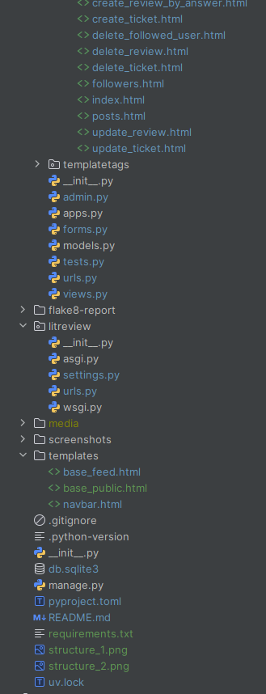
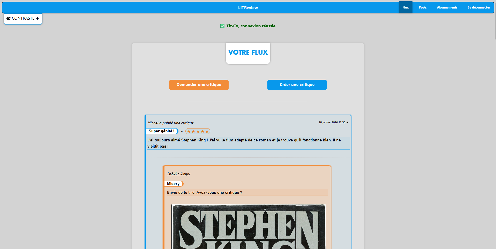
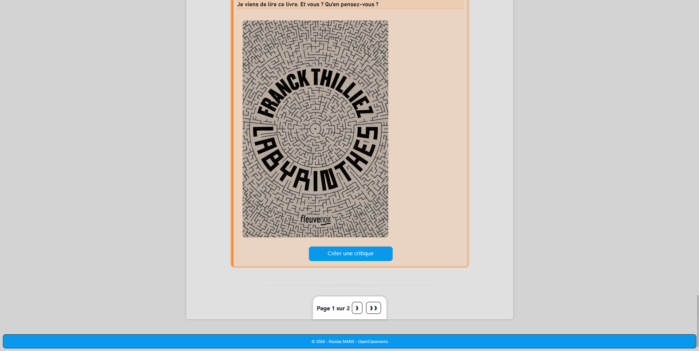
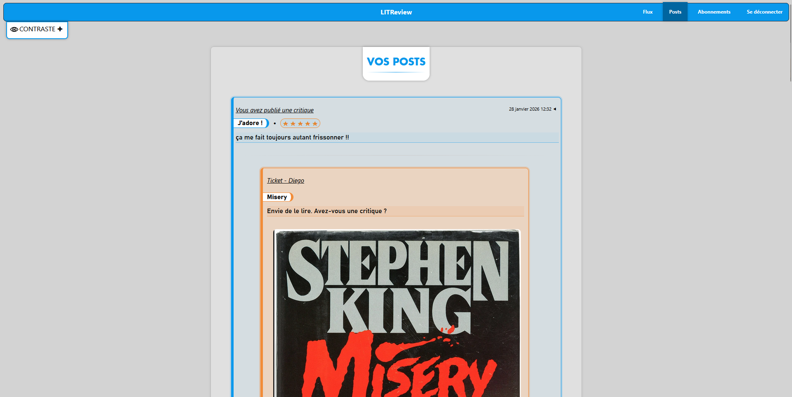
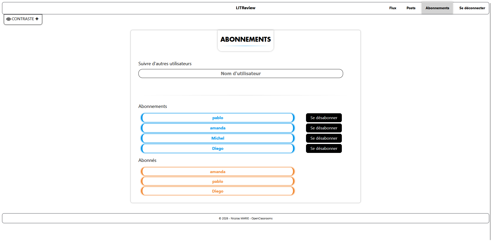
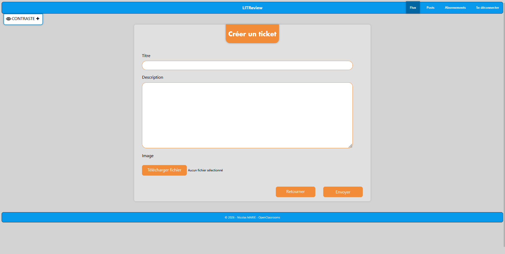
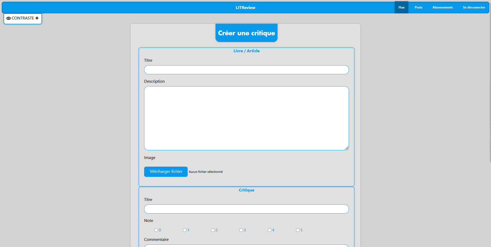
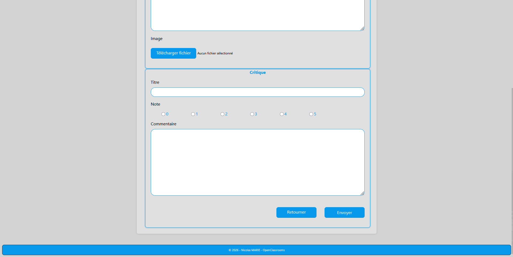
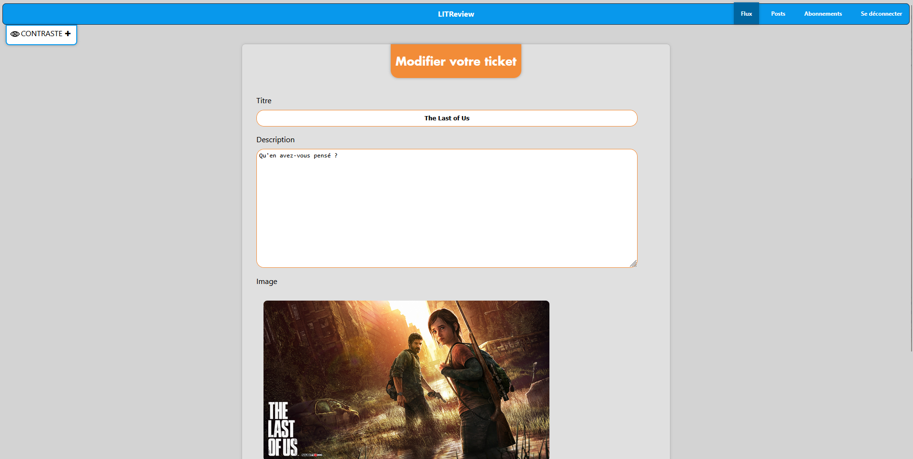

# Django app - OpenClassrooms Project 09
**Develop a web application using Django**

---

## DESCRIPTION

This project was completed as part of the "Python Developer" path at OpenClassrooms.

The goal was to develop a web application with Django capable of:
- Publishing reviews of books or articles.
- Requesting reviews, as a ticket, on a book or a defined article.
- Looking for interesting books to read based on reviews from others users.

The application must:
- Comply with WCAG guidelines for users with disabilities
- Conform to the provided mockups in terms of its design
- Conform to the provided database schema, which covers the required features
---

## EXPLANATIONS OF WHAT THE APP DOES

### <u>Sign in and log in, log out</u>

- The app allows the user to sign up or log in from the homepage, and to log out

### <u>Tickets, comments, feeds and followers</u>

- The app displays tickets and reviews in the feed and allows the user to follow others users

### <u>Add, update, delete tickets and reviews</u>

- The app allows the user to create, update and delete tickets and reviews in the feed conforming to th CRUD operations

### <u>Subscription page</u>

- The app allows the user to subscribe to others users feeds or unsubscribe from

---

## PROJECT STRUCTURE

---

## INSTALLATION

### - Clone the repository :
`git clone https://github.com/Tit-Co/OpenClassrooms_Project_09.git`

### - Navigate into the project directory :
`cd OpenClassrooms_Project_09`

### - Create a virtual environment and dependencies :
### Option 1 - with [uv](https://docs.astral.sh/uv/)

`uv` is an environment and dependencies manager.

#### - Install environment and dependencies

`uv sync`

### Option 2 - with pip

#### - Install the virtual env :

`python -m venv env`

#### - Activate the virtual env :
`source env/bin/activate`  
Or  
`env\Scripts\activate` on Windows  

### - Install dependencies 
#### Option 1 - with [uv](https://docs.astral.sh/uv/)

`uv pip install -U -r requirements.txt`

#### Option 2 - with pip

`pip install -r requirements.txt` 

---

## USAGE

### Launching server
- Open a terminal
- Go to project folder : `cd litreview`
- If needed, make migrations and execute them : 
  - `python manage.py makemigrations`
  - `python manage.py migrate`
- Launch the Django server : `python manage.py runserver`

### Launching the website
- Open a web browser
- And type the URL : `http://127.0.0.1:8000/`
---

## EXAMPLES

- Home page (sign up or log in)

    

- Sign up form

    

- Feed page

    
    

- Posts page

    
    

- Version for people with disabilities

    
    
    

- Tickets creation page

    

- Reviews creation page

    
    

- Update posts and reviews pages

    
    

## PEP 8 CONVENTIONS

- Flake 8 report

    

---

---

## AUTHOR
**Name**: Nicolas MARIE  
**Track**: Python Developer – OpenClassrooms  
**Project – Develop a web app using Django – December 2025**
